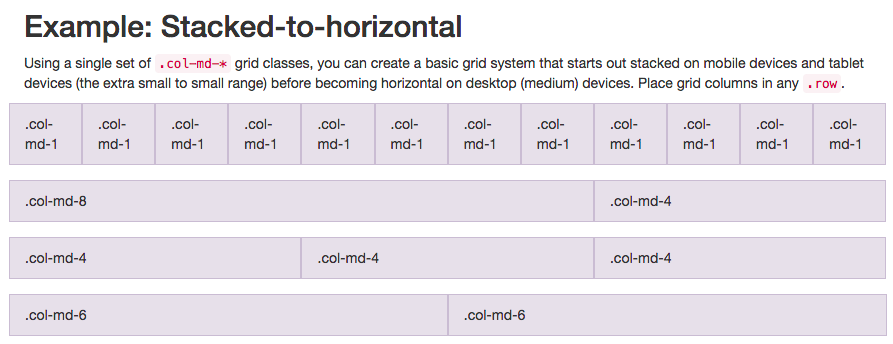

3 levels:
`container-fluid`  >  `row`  >  `col-md-*`

```html
<div class="container-fluid">
   <div class="row">
      <div class="col-md-*"><div>
      <div class="col-md-*"><div>
    </div>
   <div class="row">
      <div class="col-md-*"><div>
      <div class="col-md-*"><div>
      <div class="col-md-*"><div>
    </div>
   <div class="row">
      <div class="col-md-*"><div>
      <div class="col-md-*"><div>
    </div>
</div>  
```


